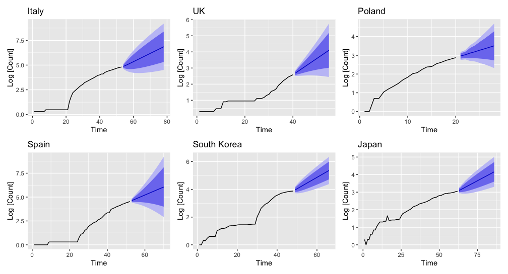

# covidR-api

## How to install?

```r
devtools::install_github("CaRdiffR/covidR-api")
```

```r
library("covidR")
```

## How to use?

A couple of examples:

```r
> get_data_by_country("Italy")


   province country reportDate cases dead recovered
1             Italy 2020-02-24   229    7         1
2             Italy 2020-02-23   155    3         2
3             Italy 2020-02-21    20    1         0
...
```

```r
> get_data_by_country("Poland", from = "2020-03-10")


  province country reportDate cases dead recovered
1           Poland 2020-03-11    31    0         0
2           Poland 2020-03-12    49    1         0
3           Poland 2020-03-10    22    0         0
4           Poland 2020-03-13    68    2         0
...
```

There's also more general function that accepts more flexible syntax:

```r
> covid_api_request("?country=Spain")
```

## Important

The data comes straight from database, so it's not cleaned. Eg. dates are not in a date format. To see how to get started with processing the data visit `examples/` folder.

## Examples

This is an example plot with ARIMA fit to logarithm of number of cases for 6 different countries.



## More

Data comes from this API https://github.com/GregVes/covid-19-api-server

Original data source is the Johns Hopkins University Center for Systems Science and Engineering's data repository:
https://github.com/CSSEGISandData/COVID-19
